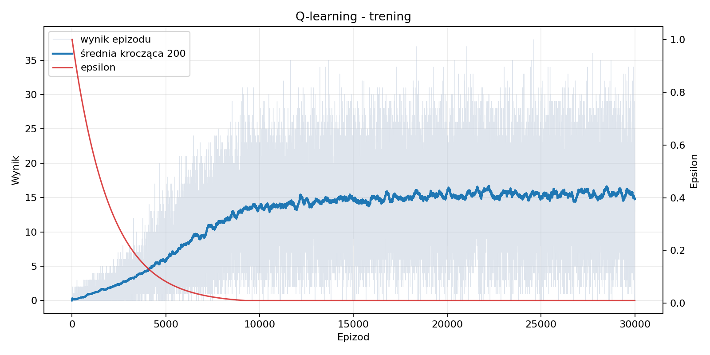
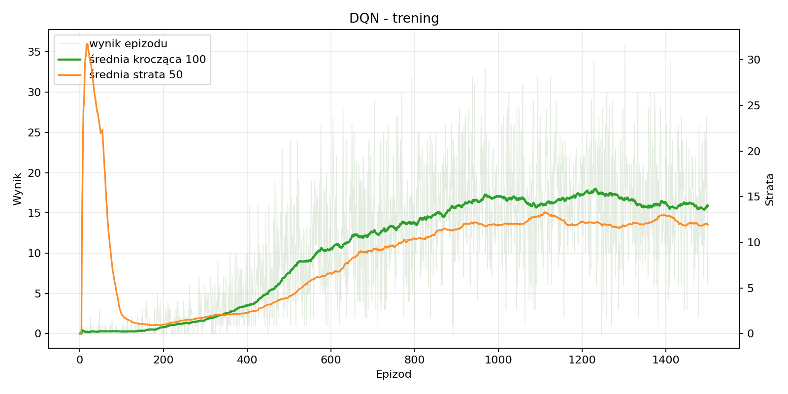
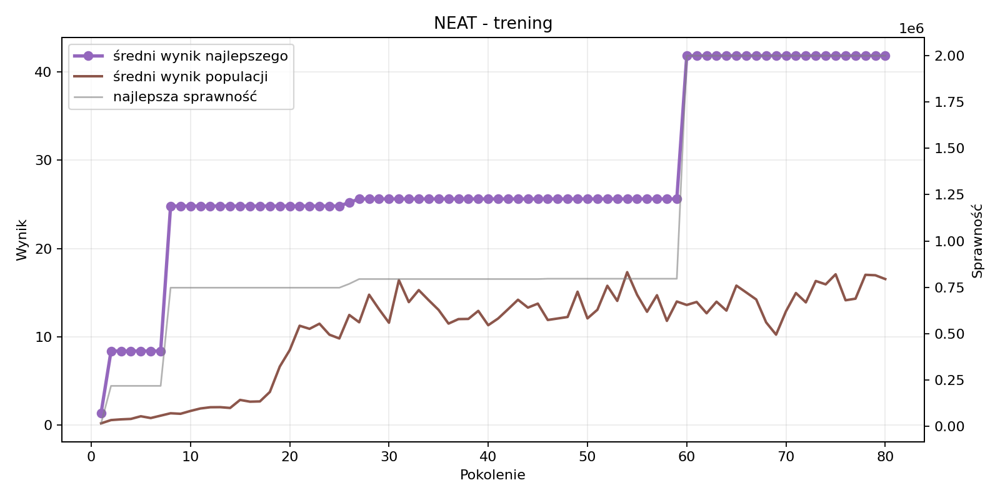
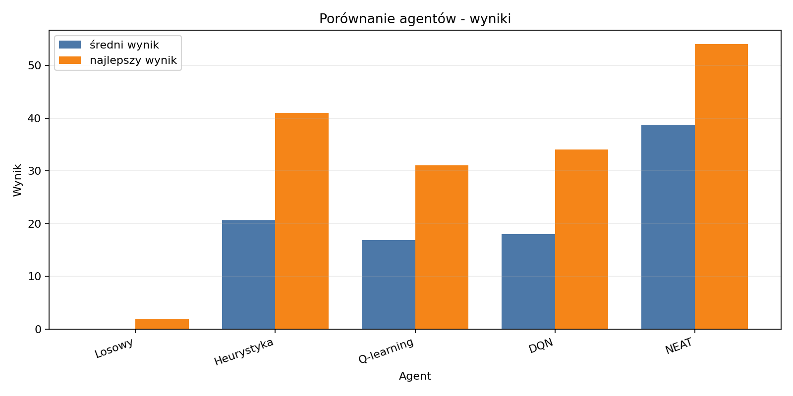
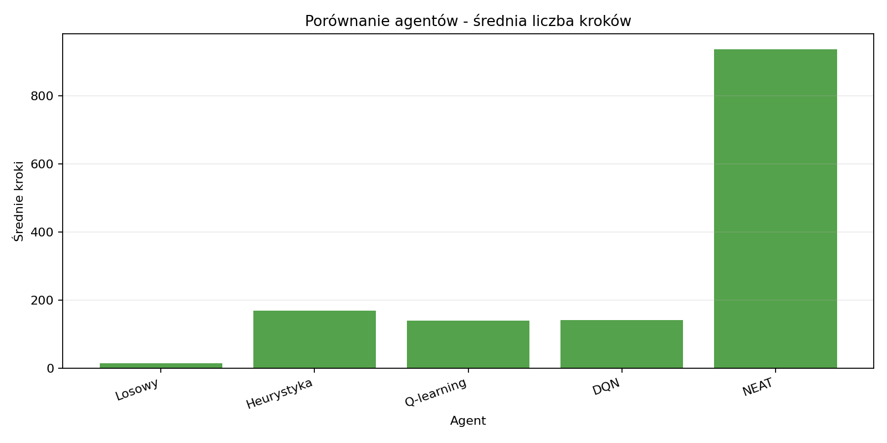

# Sterowanie agentem w grze Snake

## 1. Cel projektu

Celem projektu było stworzenie środowiska gry Snake i porównanie różnych metod sterowania agentem. Zbadano dwa punkty odniesienia, dwa algorytmy uczenia przez wzmacnianie oraz neuroewolucję:

- agent losowy,
- agent heurystyczny,
- Q-learning,
- Deep Q-Network,
- NEAT.

Projekt odpowiada tematowi sterowania agentem w wirtualnym środowisku. Łączy uczenie przez wzmacnianie, sieci neuronowe i neuroewolucję.

## 2. Problem i zasady gry

Agent steruje wężem na planszy `10x10`. W każdym kroku wybiera jeden z trzech ruchów:

- ruch prosto,
- skręt w prawo,
- skręt w lewo.

Za zjedzenie jedzenia wynik rośnie o jeden, a wąż wydłuża się. Gra kończy się po uderzeniu w ścianę, kolizji z własnym ciałem, zapełnieniu planszy albo osiągnięciu limitu `1000` kroków.

## 3. Środowisko RL

Stan Q-learningu i DQN ma 15 cech. Zawiera informacje o zagrożeniu dla trzech możliwych akcji, kierunku ruchu, położeniu jedzenia, odległości od ścian i od ogona.

Funkcja nagrody wykorzystuje:

| Zdarzenie | Nagroda lub kara |
| --- | ---: |
| zjedzenie jedzenia | `+10` |
| kolizja ze ścianą | `-30` |
| kolizja z ciałem | `-30` |
| osiągnięcie limitu kroków | `-15` |
| zmniejszenie odległości od jedzenia | `+0,15` |
| zwiększenie odległości od jedzenia | `-0,10` |
| zwykły krok | około `-0,01` |

Środowisko dodaje również stopniowe kary za bliskość ściany lub ciała oraz wejście do obszaru zbyt małego dla aktualnej długości węża.

## 4. Badani agenci

### 4.1. Agent losowy

Wybiera losowy kierunek. Nie uczy się i pokazuje, jak wygląda gra bez żadnej strategii.

### 4.2. Agent heurystyczny

Wybiera bezpieczny ruch prowadzący najbliżej jedzenia. Nie uczy się, ale stanowi mocny punkt odniesienia.

### 4.3. Q-learning

Agent zapisuje w tablicy Q, które ruchy były korzystne w poszczególnych sytuacjach. Podczas treningu czasami wybiera ruch losowy, aby poznawać nowe możliwości. Z czasem coraz częściej korzysta z wcześniej zdobytej wiedzy.

| Parametr | Wartość |
| --- | ---: |
| epizody | 30 000 |
| szybkość uczenia | 0,1 |
| znaczenie przyszłych nagród | 0,9 |
| losowość na początku | 1,0 |
| minimalna losowość | 0,01 |

### 4.4. DQN

DQN zastępuje tablicę Q siecią neuronową napisaną w PyTorch. Sieć ma dwie warstwy po 64 neurony. Agent zapisuje wcześniejsze doświadczenia i wykorzystuje je podczas dalszej nauki. Używa również osobnej sieci pomocniczej, która stabilizuje trening.

| Parametr | Wartość |
| --- | ---: |
| epizody | 1 500 |
| warstwy ukryte | 64, 64 |
| znaczenie przyszłych nagród | 0,9 |
| szybkość uczenia | 0,001 |
| liczba doświadczeń używanych jednocześnie | 64 |
| pojemność pamięci | 20 000 |
| aktualizacja sieci pomocniczej | co 20 epizodów |

### 4.5. NEAT

NEAT tworzy populację sieci neuronowych i wybiera z niej najlepsze. W kolejnych pokoleniach zmienia ich połączenia i wagi. Każda sieć była oceniana w pięciu grach. Ocena uwzględniała wynik, zbliżanie się do jedzenia, długość przeżycia i unikanie zapętlenia.

| Parametr | Wartość |
| --- | ---: |
| pokolenia | 80 |
| liczebność populacji | 100 |
| gry oceniające sieć | 5 |
| wejścia sieci | 30 |
| wyjścia sieci | 3 |
| zapis stanu treningu | co 5 pokoleń |

NEAT otrzymuje więcej informacji o planszy niż Q-learning i DQN. Pomija również ruchy prowadzące bezpośrednio do kolizji. Należy o tym pamiętać podczas porównywania wyników.

## 5. Metodyka eksperymentu

Wszystkie testy wykonano na planszy `10x10` z limitem `1000` kroków. Każdy agent rozegrał `100` gier na tych samych układach początkowych.

Mierzone wartości:

- średni wynik,
- najlepszy wynik,
- średnia liczba kroków,
- liczba epizodów lub pokoleń treningu.

Wszystkie modele zostały przetrenowane od zera przed wykonaniem końcowego porównania.

## 6. Przebieg treningów

| Algorytm | Długość treningu | Najlepsza gra | Wynik na początku | Wynik pod koniec |
| --- | ---: | ---: | ---: | ---: |
| Q-learning | 30 000 epizodów | 38 | 0,57 | 15,48 |
| DQN | 1 500 epizodów | 36 | 0,26 | 15,90 |
| NEAT | 80 pokoleń | 44 | 1,40 | 41,80 |

Dla Q-learningu porównano średnie z pierwszych i ostatnich `1000` epizodów, dla DQN z pierwszych i ostatnich `100`, a dla NEAT wynik najlepszej sieci.

### Q-learning



Na początku agent osiągał bardzo niskie wyniki. W kolejnych epizodach coraz częściej zdobywał kilkanaście punktów. Pod koniec treningu poprawa była już niewielka.

### DQN



DQN potrzebował mniej epizodów niż Q-learning. Ostatnie 100 epizodów było dużo lepsze od pierwszych 100, ale wyniki nadal wyraźnie różniły się między grami.

### NEAT



NEAT poprawiał się skokowo. Największa poprawa nastąpiła w 60. pokoleniu, gdy średni wynik najlepszej sieci wzrósł z `25,60` do `41,80`. Wynik całej populacji zmieniał się między pokoleniami, ale pod koniec był znacznie lepszy niż na początku.

## 7. Wyniki końcowe

| Agent | Średni wynik | Najlepszy wynik | Średnia liczba kroków | Trening |
| --- | ---: | ---: | ---: | ---: |
| losowy | 0,12 | 2 | 14,14 | 0 |
| heurystyka | 20,65 | 41 | 169,81 | 0 |
| Q-learning | 16,86 | 31 | 139,29 | 30 000 epizodów |
| DQN | 17,97 | 34 | 141,60 | 1 500 epizodów |
| NEAT | 38,69 | 54 | 936,99 | 80 pokoleń |





## 8. Analiza wyników

NEAT uzyskał najwyższy średni i najlepszy wynik. Osiągał też znacznie większą liczbę kroków, często grając blisko limitu. Korzystał jednak z większej liczby informacji o planszy i odrzucał ruchy prowadzące bezpośrednio do kolizji.

Agent heurystyczny zajął drugie miejsce. Pokazuje to, że prosta wiedza o problemie może być bardzo skuteczna i stanowi wymagający punkt odniesienia dla metod uczonych.

DQN osiągnął wynik nieco lepszy od Q-learningu mimo znacznie krótszego treningu. Nie udało mu się jednak pokonać prostej heurystyki.

Q-learning nauczył się grać znacznie lepiej od agenta losowego, ale musi zapamiętywać wiele sytuacji osobno w tablicy Q.

Agent losowy prawie zawsze szybko przegrywał. Spełnił rolę dolnej granicy jakości.

## 9. Wnioski

1. NEAT był najlepszym rozwiązaniem w zastosowanej konfiguracji i osiągnął średni wynik `38,69`.
2. Heurystyka była bardzo mocnym punktem odniesienia i pokonała oba badane algorytmy RL.
3. Q-learning działa, ale tablica Q ogranicza jego możliwości.
4. DQN osiągnął trochę lepszy wynik od Q-learningu, lecz wymaga dłuższego treningu.
5. Wynik zależy również od informacji przekazywanych agentowi i sposobu przyznawania nagród.
6. Pełne 80 pokoleń NEAT było potrzebne, ponieważ największa poprawa pojawiła się dopiero w 60. pokoleniu.

## 10. Ograniczenia i dalszy rozwój

- wykonać kilka niezależnych treningów i porównać ich wyniki,
- przekazać wszystkim uczonym agentom taki sam zestaw informacji,
- sprawdzić większe plansze i inne limity kroków,
- dłużej trenować DQN,
- zakończyć grę, gdy agent przez długi czas nie zdobywa punktów.

## 11. Uruchomienie i prezentacja

Instalacja:

```bash
pip install -r requirements.txt
```

Podczas prezentacji:

```bash
python run_experiments.py
python plot_results.py
python display_grid.py
```

Pierwsza komenda odtwarza tabelę wyników z zapisanych modeli, druga generuje wykresy, a trzecia pokazuje agentów w działaniu.

Trening lub kontynuacja modeli:

```bash
python -m project.training.train_q_learning
python -m project.training.train_dqn
python -m project.training.train_neat
```

Kod pomocniczy, treningi, modele i wyniki znajdują się w katalogu `project/`. Historie są w `project/data/results/`, modele w `project/data/models/`, wykresy w `project/data/results/plots/`, a checkpointy NEAT w `project/data/checkpoints/`.

## 12. Bibliografia

1. R. S. Sutton, A. G. Barto, *Reinforcement Learning: An Introduction*, wydanie 2, 2018: <http://incompleteideas.net/book/the-book-2nd.html>
2. C. J. C. H. Watkins, P. Dayan, *Q-learning*, Machine Learning 8, 1992: <https://doi.org/10.1007/BF00992698>
3. V. Mnih i in., *Human-level control through deep reinforcement learning*, Nature 518, 2015: <https://doi.org/10.1038/nature14236>
4. K. O. Stanley, R. Miikkulainen, *Evolving Neural Networks through Augmenting Topologies*, Evolutionary Computation 10(2), 2002: <https://doi.org/10.1162/106365602320169811>
5. Dokumentacja PyTorch: <https://pytorch.org/docs/stable/>
6. Dokumentacja neat-python: <https://neat-python.readthedocs.io/>
7. G. Madejski, *Propozycje projektów 2026*, plik `projekty2025-26-letni.pdf` dołączony do projektu.
